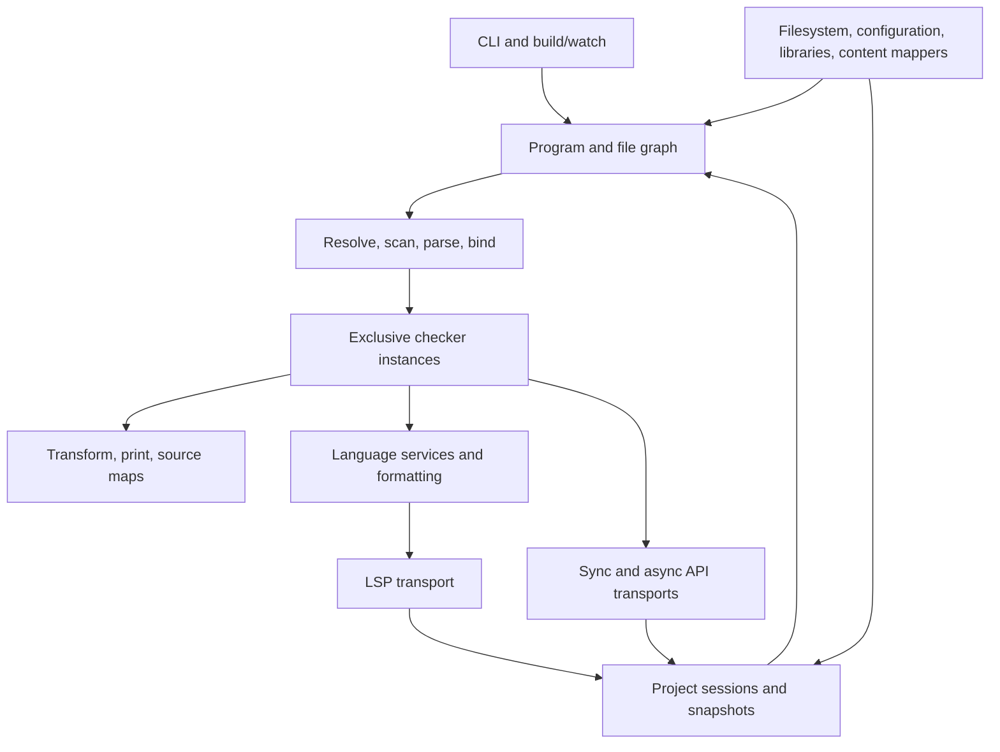

**C# rewrite plan for the complete TypeScript `tsc` backend**

Analysis date: 2026-09-22. Reference revision: `f29aeb9f825d96feea27841f3f7342dbf0df68a8` (`Bump adm-zip from 0.6.0 to 0.6.1 (#64347)`). Scope confirmed: the full backend, including compiler, build/watch, language server, and compiler API. Current toolchain: .NET 11 nightly SDK `11.0.100-rc.2.26470.103` with C# 15; final target: .NET 11 GA when available. The complete backend must remain NativeAOT-compatible.

Port the current Go implementation's semantics into C#, keep its observable contracts, and optimize measured costs behind differential tests. Target .NET 11 and use C# 15 throughout, including its type-system features to consolidate equivalent logic and encode invariants. Prefer existing high-performance BCL helpers over custom infrastructure. Preserve behavior without requiring the same source structure or duplication as Go. NativeAOT compatibility is an architectural requirement from the first milestone; published NativeAOT artifacts are the release-validation baseline for every backend mode. Resolve NativeAOT platform coverage, runtime diagnostics, text representation, stack behavior, and memory layout before committing to the full checker port.

**Compatibility clarification (user direction, 2026-09-22).** The goal is semantic correctness and preservation of supported functionality, not 100% replication of Go's behavior. The Go backend is a valuable reference and regression oracle, not an infallible specification. The rewrite may differ where both results are semantically valid, or where evidence establishes that the reference behavior is a bug. This clarification governs the comparisons and phase gates throughout this plan, including earlier requirements for exact output.

**Implementation clarification (reiterated during phase 2).** Zero strict Go-output differences is not a completion requirement. Classify differences against TypeScript language behavior and consumer contracts. Internal parser-context bookkeeping and equivalent trivia boundaries may differ when the language tree is unchanged. For malformed input, require correct rejection, meaningful diagnostic spans, safe recovery, and a structurally valid tree; the recovered tree need not duplicate Go. Keep independent TypeScript/ECMAScript checks and named comparison policies as evidence. Genuine acceptance/rejection, syntax, lifetime, protocol, and workflow regressions remain blocking.

**Difference ledger (user direction).** Document every intentional departure from the pinned Go implementation, even when semantically correct. Keep the case identifier, source hash, reference and candidate results, rationale, independent evidence, and reproducible comparison command. Retain strict comparison results alongside semantic gates. This ledger must make a future requirement for 100% Go compatibility actionable; permitted differences must remain visible and individually traceable rather than disappearing behind normalization. The [parser compatibility audit](csharp-parser-compatibility.md) describes the record format, policies, and strict reproduction commands.

**Runtime async (user direction).** Enable `<Features>$(Features);runtime-async=on</Features>` in shared build settings. Use BCL `Task`/`ValueTask` and directly await them where possible. Custom task-like types or async method builders require a demonstrated need; convenience alone is not sufficient. The production parser uses standard `ValueTask` methods, configured direct awaits, and the BCL's forced-yield option when native stack space is low. Revalidate native execution after changing this compiler feature.

Keep language/type-system correctness, emitted-program behavior, supported options and workflows, and compatibility with existing clients and persisted formats as requirements. Preserve exact bytes or identities where a consumer actually relies on them: wire framing/widths/encoding, content hashes, source positions, API identity/lifetime, and interoperable build state. Internal allocation, scheduling, data structures, implementation-specific rounding allowed by ECMAScript, diagnostic wording, and nonsemantic output formatting need not copy Go merely for equality. A formatting or wording change still needs to retain meaningful spans, source maps, tooling integration, and any documented contract.

Classify each differential failure before deciding whether to fix it. A permitted difference needs a named, narrowly scoped comparison policy and evidence from language semantics, independent execution, or client-contract tests. Record the rationale and affected cases; do not suppress a whole failing suite or broadly normalize output until it passes. For example, ECMAScript permits implementation-approximated exponentiation, so use BCL `Math.Pow` with JavaScript's required special cases rather than porting Go's transcendental implementation for bitwise equality. NaN, signed zero, infinity, bitwise conversion, and other specified behavior still need explicit tests. A numeric tolerance used by a test is a regression guard, not a specification-defined error bound or proof of correctness. [ECMAScript Number exponentiation](https://tc39.es/ecma262/multipage/ecmascript-data-types-and-values.html#sec-numeric-types-number-exponentiate).

This is a source-backed implementation plan, not evidence that a C# implementation will outperform Go. No finite test suite proves correctness for every possible input. The release requirement is no unexplained semantic regressions across the recorded contracts, existing suites, added differential tests, and representative real projects. Go quirks do not automatically become requirements; semantically meaningful differences require investigation and evidence.

**1. What is being rewritten**

The checkout already contains the native Go implementation. The reference is this checkout, not the historical compiler written in TypeScript, nor an assumed TypeScript 6 API. The TypeScript npm/VS Code clients remain clients of the new C# backend. Existing JavaScript exports, scanner/AST helpers, and sync/async call patterns remain compatible; converting those clients to C# is outside the confirmed backend scope.

The inventory below counts physical lines in `.go` files under `tsc/internal` and `tsc/cmd`, excluding `*_test.go`. It includes generated code and test infrastructure. It excludes assembly, assets, test inputs, and the separate `tools` module. Line counts describe scope, not runtime cost.

| Area | Files | Lines | Implication |
| --- | ---: | ---: | --- |
| Checker | 25 | 60,831 | Largest semantic port; inference, relations, flow, JSDoc, JSX, emit queries, and type display must move together. |
| Language services | 63 | 41,555 | Editor parity is a substantial workstream beyond compiler correctness. |
| Transformers | 41 | 24,406 | Preserve transformation ordering and synthetic-node metadata. |
| LSP | 12 | 22,035 | Includes 17,551 lines of generated protocol code. |
| AST | 21 | 21,219 | Includes 10,896 lines in generated/stringer files; generation should supply C# equivalents. |
| Project system | 39 | 12,856 | Snapshots, caches, lifetimes, automatic type acquisition, and watcher invalidation. |
| Compiler API | 15 | 12,758 | Transport, callbacks, handles, AST encoding, and session semantics. |
| Printer | 17 | 11,748 | Exact output, comments, names, helpers, and source maps. |
| CLI/build/watch | 33 | 10,105 | Includes incremental state and command test infrastructure. |
| Parser / scanner / binder | 13 | 17,002 | Preserve recovery, rescanning, parent links, symbol construction, and flow nodes. |
| Compiler orchestration | 14 | 6,612 | File discovery, program reuse, checking, and emit coordination. |
| Configuration/options | 20 | 6,629 | Defaults, tri-state options, JSONC, diagnostics, and project discovery. |
| Everything else | 234 | 70,091 | Supporting semantics, filesystem, generated diagnostics, harnesses, and resources. |
| **Total** | **547** | **317,847** | **47,332 lines are in files whose names contain `generated` or `stringer`.** |

The checker alone contains a 32,575-line `checker.go`. Replacing its algorithms while changing runtime, storage, and concurrency would multiply the debugging work. Preserve its semantic rules and observable branch behavior, while using C# abstractions to share equivalent implementations. Partial classes can organize the remaining checker responsibilities; there is no requirement for a one-to-one function or file translation.

The existing test inventory is also significant:

| Inventory | Static count | Interpretation |
| --- | ---: | --- |
| Compiler input files | 6,831 | `.ts`/`.tsx` files under compiler cases. |
| Conformance input files | 5,899 | Many inputs expand into several option configurations. |
| Reference baseline files | 48,106 | Outputs, not 48,106 independent tests. |
| Go test files under `tsc` | 4,546 | Includes the fourslash files below. |
| Fourslash test files | 4,357 | Tests exercise services through a Go harness. |
| Fourslash files containing `t.Skip(` | 386 | Static evidence of exclusions; not an executed skip count. |
| TypeScript API/client test files | 13 | Discovered `*.test.ts` files; generated sync tests also need generation and execution. |

The compiler runner has an explicit exclusion list and calls `SkipUnsupportedCompilerOptions`; the LSP replay test skips without a supplied replay. An apparently green run can therefore omit relevant behavior. Record executed cases, expanded configurations, skips, and failures before defining parity. See the [compiler runner](D:/source/repos/TypeScript/tsc/internal/testrunner/compiler_runner.go:78), [compiler assertions](D:/source/repos/TypeScript/tsc/internal/testrunner/compiler_runner.go:199), and [replay entry point](D:/source/repos/TypeScript/tsc/internal/lsp/replay_test.go:40).

**2. Current architecture and constraints to carry forward**

The [entry point](D:/source/repos/TypeScript/tsc/cmd/tsc/main.go:18) dispatches to ordinary CLI compilation, `--lsp`, or `--api`. CLI processing additionally dispatches build mode, watch mode, configuration commands, tracing, and profiling. All three frontends share compiler and project functionality.



Important source findings:

- **Parallel checking already exists.** The [compiler checker pool](D:/source/repos/TypeScript/tsc/internal/compiler/checkerpool.go:22) partitions the import graph, uses separate checker caches, preserves file order within each partition, and combines diagnostics deterministically. Its default is four checkers, with single-threaded and explicit checker-count controls. Port the existing partition policy and defaults before tuning them. CPU count alone is not an equivalent policy.
- **The editor and API have different checker lifetimes.** The [project pool](D:/source/repos/TypeScript/tsc/internal/project/checkerpool.go:30) distinguishes a diagnostics checker, temporary query checkers, and a persistent API checker. The persistent checker protects type/symbol identity. Replacing all three with a generic expiring pool would regress API behavior.
- **Allocation is already optimized.** The [arena](D:/source/repos/TypeScript/tsc/internal/core/arena.go:7), [link stores](D:/source/repos/TypeScript/tsc/internal/core/linkstore.go:7), and [generated factories](D:/source/repos/TypeScript/tsc/internal/ast/ast_generated.go:20) allocate typed blocks. A literal C# translation that creates several heap objects per node could be materially larger than the Go baseline.
- **Source positions are byte based.** [Position maps](D:/source/repos/TypeScript/tsc/internal/ast/positionmap.go:9) bridge UTF-8 offsets to UTF-16. The [API binary format](D:/source/repos/TypeScript/tsc/internal/api/encoder/encoder.go:65) is version 8, with a 44-byte header, 28-byte node records, little-endian values, an xxh3 content hash, and WTF-8 support for lone surrogates. These are existing client contracts.
- **Language strings need explicit semantics.** [String utilities](D:/source/repos/TypeScript/tsc/internal/stringutil/util.go:301), [case mapping](D:/source/repos/TypeScript/tsc/internal/stringutil/js_case.go:9), and [JS numbers](D:/source/repos/TypeScript/tsc/internal/jsnum/jsnum.go:1) handle cases that cannot be replaced blindly with .NET casing, encoding, numeric conversion, or formatting.
- **Emit is an ordered pipeline.** [Transformer selection](D:/source/repos/TypeScript/tsc/internal/compiler/emitter.go:112) orders metadata, type erasure, import elision, runtime syntax, decorators, JSX, downleveling, strict mode, module transformation, and inlining. Declaration emission has its own semantic dependencies. A generic transpiler is not a substitute.
- **Incremental and server state are separate mechanisms.** [Build info](D:/source/repos/TypeScript/tsc/internal/execute/incremental/buildInfo.go:466) persists compiler state; [project snapshots](D:/source/repos/TypeScript/tsc/internal/project/snapshot.go:30) retain immutable versions and shared resources across requests. Both need explicit lifetime and compatibility tests.
- **Content mappers are current functionality.** [Mapper hosting](D:/source/repos/TypeScript/tsc/internal/contentmapper/contentmapper.go:1) runs external processes over JSON-RPC, shares mapper processes by identity, and projects non-TypeScript content into virtual files. Preserve supplemental files, span-map fidelity, mapped diagnostics, invalidation, and the existing `runExternalCode` permission behavior.
- **Watching is platform-specific.** The [watcher implementation](D:/source/repos/TypeScript/tsc/internal/fswatch/README.md:1) uses Windows directory notifications, Linux fanotify/inotify, macOS FSEvents/kqueue, and BSD kqueue. Its overflow, termination, batching, and callback serialization behavior must survive the rewrite.

**3. Feasibility gates before the full port**

**Platform coverage.** The [release matrix](D:/source/repos/TypeScript/Herebyfile.mjs:2115) lists 21 npm platform targets, with some BSD targets explicitly described as best effort. Inventory published artifacts and their OS/ABI minimums in phase 0; the matrix is configuration evidence, not proof that every artifact works today.

| Existing target group | Targets | Required C# route |
| --- | --- | --- |
| Windows | x64, arm64 | Publish and test .NET 11 NativeAOT on both architectures. |
| Linux mainstream | x64, arm, arm64 | Publish and test .NET 11 NativeAOT; verify ARM version, ABI, libc baseline, and Alpine packaging. |
| macOS | x64, arm64 | Publish and test .NET 11 NativeAOT with native signing/notarization. |
| Android | arm64 | Validate a NativeAOT command-line distribution in the existing Node environment; mobile application support alone is insufficient. |
| Other Linux architectures | loong64, mips64el, ppc64, riscv64, s390x | Establish a supported or project-maintained NativeAOT runtime/compiler route per architecture. |
| Other operating systems | aix-ppc64; freebsd/netbsd/openbsd x64 and arm64; sunos-x64 | Establish NativeAOT compiler/runtime, native interop, packaging, and test-host support for each target. |

Microsoft's current Native AOT table covers the mainstream desktop targets above and labels Android experimental; it does not cover the whole repository matrix. Verify actual target support in the pinned .NET 11 RC compiler/runtime packs. A community port must provide a working NativeAOT route, maintainership, CI, and performance results; JIT support alone does not close this gap. Keeping Go for unsupported targets is a migration tactic, not completion of the requested C# rewrite. Dropping targets would require an explicit scope change. [Native AOT platform documentation](https://learn.microsoft.com/en-us/dotnet/core/deploying/native-aot/).

**Toolchain (updated user direction, 2026-09-22).** Use `net11.0` and `LangVersion=15.0`, pinned to the supplied nightly SDK `11.0.100-rc.2.26470.103` at `D:\dotnet-sdk-11.0.100-rc.2.26470.103-win-x64`. Use this nightly during development to incorporate fixes absent from RC1. Add the `dotnet11` NuGet source `https://pkgs.dev.azure.com/dnceng/public/_packaging/dotnet11/nuget/v3/index.json` in `csharp/NuGet.Config` so its matching preview runtime, compiler and linker packages can restore. Pin the exact SDK with `allowPrerelease: true` and `rollForward: disable` in `csharp/global.json`; invoke this SDK's `dotnet.exe` or put its directory first on PATH. SDK resolution alone does not make a separately installed executable discoverable.

The final product target is **.NET 11 GA**, once available. Nightly is the current development toolchain, not a permanent release requirement. Update the SDK and NuGet lockfiles deliberately for later nightlies and GA, then rerun semantic/contract tests, NativeAOT analysis/publish/execution, profiling and measurements. Record the exact SDK/runtime/compiler pack versions with results, and retain RC1 results only as historical evidence. There is no requirement to retain C# 14 or .NET 10 compatibility.

Audit OS, CPU instruction-set, ABI, and libc minimums of the actual .NET 11 NativeAOT artifacts. The .NET 11 runtime documentation records hardware-baseline changes, but CoreCLR/ReadyToRun requirements must not be assumed to describe NativeAOT output. Test the oldest retained hardware/OS combinations; a higher minimum is a compatibility change requiring resolution. [Runtime changes in .NET 11](https://learn.microsoft.com/en-us/dotnet/core/whats-new/dotnet-11/runtime).

**Profiling and runtime controls.** The [profiling backend](D:/source/repos/TypeScript/tsc/internal/pprof/pprof.go:23) exposes CPU, allocation, and heap profiles in pprof format, including server operations. Prove that the published NativeAOT executable can retain these operations and produce usable artifacts, through an in-process collector or a reliable conversion pipeline. Do not silently replace them with instructions to run a different tool. Names of managed frames and measured resource values necessarily differ; preserve command/protocol behavior, artifact format, sample meaning, and usability. Inventory Go-specific environment/debug controls separately and specify equivalents or unresolved incompatibilities. Passing a CoreCLR profiling experiment does not satisfy this NativeAOT release gate.

**Stack behavior.** Go and .NET have different stack models. Deep syntax and recursive types must not start terminating the C# process where Go returns successfully or reports a compiler diagnostic. Preserve existing semantic limits, including the checker's instantiation budgets. Use explicit work stacks for unbounded input-shaped walks, and continuation frames for recursive paths that exceed safe native stack depth. Do not introduce a smaller language limit, depend on catching `StackOverflowException`, or treat one larger worker stack as a complete solution. Prototype pathological parser, relation, inference, printer, and traversal cases early.

**Distribution.** Publish the release-validation executable with NativeAOT for CLI, watch/build, `--lsp`, and `--api`. End users should not acquire a new prerequisite to install a system .NET runtime. CoreCLR builds can support developer debugging and comparative experiments; they cannot substitute for a failing NativeAOT feature, platform, or performance gate. Keep the same externally selected executable and frontend flags.

Native AOT requires native toolchains and does not offer ordinary cross-OS publishing. Plan Windows, Linux, and macOS build/signing workers, target-specific libc baselines, and tests of the packaged artifacts. [Cross-compilation documentation](https://learn.microsoft.com/en-us/dotnet/core/deploying/native-aot/cross-compile).

**4. Proposed C# implementation**

Use a small number of assemblies with namespaces matching source responsibilities. Start with one backend library and one executable; use internal interfaces for hosts and protocol boundaries. Splitting every Go package into an assembly would add build and dependency overhead without improving the port.

**BCL first.** Before writing a general-purpose helper, check the pinned .NET 11 reference APIs and implementations. Use an existing BCL operation when it satisfies the required semantics; compose it behind a thin compiler-specific wrapper where needed. Porting a Go utility does not imply reimplementing it in C#. Prototype a custom replacement only after identifying a semantic gap or a measured bottleneck; keep it only when it closes that gap or provides a repeatable NativeAOT performance/memory advantage over the appropriate BCL implementation. Fewer calls or a hand-written SIMD loop alone is not evidence.

| Requirement | First implementation to evaluate | Compatibility/performance check |
| --- | --- | --- |
| Scanning and span search | `MemoryExtensions` operations and reusable `SearchValues<byte>`/`SearchValues<char>` for repeated character sets. | Preserve token boundaries, encoding, and malformed-input behavior; measure construction cost and reuse. |
| Temporary buffers and output | `ArrayPool<T>`, `ArrayBufferWriter<T>`, `IBufferWriter<T>`, and span-based copy/format operations. | Clear reference-bearing pooled storage appropriately; preserve ownership, bounds, and retained-memory budgets. |
| Maps and lookup | `Dictionary<TKey,TValue>`, `HashSet<T>`, `OrderedDictionary<TKey,TValue>`, and alternate-key lookup when the comparer supports it. | Preserve ordering and domain equality; use span lookup to avoid temporary strings where supported. |
| Read-mostly tables | `FrozenDictionary`/`FrozenSet`, or generated switches for small fixed domains. | Include construction/startup and memory cost; do not freeze mutable checker state. |
| Dictionary hot paths | Existing APIs first; `CollectionsMarshal` ref access only where measurements justify it. | Never retain a value ref across mutations that can invalidate it. |
| Binary framing and codecs | `BinaryPrimitives`, `SequenceReader<T>`, and generated `System.Text.Json` metadata over standard readers/writers. | Keep exact widths, byte order, framing, field omission, and text semantics; add only the format-specific logic. |
| Scheduling, cancellation, and time | `Task`, bounded `Channel<T>`, `SemaphoreSlim`, `CancellationToken`, and `TimeProvider`. | Preserve compiler ordering, request ownership, fake-time behavior, queue completion, and callback reentrancy. |

The BCL includes optimized reusable search sets, generic ordered dictionaries, and alternate-key dictionary lookup. Alternate lookup requires a compatible comparer; it is not an automatic substitute for the compiler's custom Unicode/path semantics. [SearchValues](https://learn.microsoft.com/en-us/dotnet/api/system.buffers.searchvalues), [OrderedDictionary](https://learn.microsoft.com/en-us/dotnet/api/system.collections.generic.ordereddictionary-2), [alternate-key lookup](https://learn.microsoft.com/en-us/dotnet/api/system.collections.generic.dictionary-2.getalternatelookup).

**Portable SIMD and NativeAOT instruction sets (user direction, 2026-09-22).** NativeAOT's default x64 instruction set does not enable AVX merely because the build machine supports it. Use `/p:IlcInstructionSet=native` for the requested performance experiments so measurements evaluate the current processor's available instruction sets. **Measure only the host-native build; the user does not request or need portable-baseline measurements.** Record the SDK, architecture, CPU model, instruction-set setting and executable hash with every result.

Set `OptimizationPreference` to **`Speed`** in the shared C# build properties, as requested. Keep this setting in the NativeAOT build and measurement record alongside `IlcInstructionSet=native`; rerun measurements when optimization settings change rather than attributing old results to the new configuration.

Use SIMD where it benefits measured workloads, starting with vectorized BCL helpers such as span search/count/copy, `SearchValues`, UTF-8 validation/transcoding and hashing. If a remaining compiler-specific kernel benefits from explicit vectorization, use portable `System.Numerics.Vector<T>` or architecture-neutral `Vector128<T>`/`Vector256<T>`/`Vector512<T>` operations, appropriate hardware-acceleration checks, and scalar/tail handling. Avoid requiring x86-only intrinsics in shared compiler logic. Verify equal semantic results with acceleration available and unavailable, and on retained architectures; vector width must not affect behavior.

Portable SIMD source does not make a host-native binary runnable on every older CPU. `/p:IlcInstructionSet=native` is the requested development/benchmark configuration, or an explicitly selected CPU-specific distribution variant. General release artifacts must target the retained CPU requirements with suitable dispatch/fallbacks. Treat CPU compatibility as a separate packaging gate, without adding portable-baseline performance measurements to this task. Carry this distinction through phase-1 experiments and release packaging.

Keep custom code focused on TypeScript semantics and compiler-specific ownership/data layout: WTF-8, JavaScript casing/numbers, exact wire/build-info formats, and node/side-table lifetimes may need adapters. Build those adapters from BCL primitives wherever equivalent. Do not copy runtime-internal helpers such as `ValueListBuilder<T>` merely because they are not public APIs. Keep a short record of the BCL alternatives and evidence for each substantial custom infrastructure helper; reevaluate it when the pinned runtime changes.

**Storage beyond BCL array limits.** The user has approved [Hezium.Memory](https://github.com/hez2010/Hezium.Memory) when the implementation needs larger managed arrays. Its `BigArray<T>` provides contiguous, GC-managed storage with `nint` indexing, including reference-bearing elements; `BigMemory<T>`/`BigReadOnlyMemory<T>` provide storable views, and `BigSpan<T>`/`BigReadOnlySpan<T>` provide stack-bound views. It also supplies copy, search, comparison, and sorting operations, including `SearchValues<T>` integration. Prefer these existing primitives and algorithms over inventing another large-array implementation when ordinary BCL storage cannot satisfy the requirement. Keep using BCL operations on ordinary spans and bounded windows where appropriate. [Package documentation](https://github.com/hez2010/Hezium.Memory#api-map).

Include Hezium.Memory in the phase-1 storage experiment if measured owner sizes or contiguous-storage requirements reach BCL limits. Pin the evaluated package version; `1.2.0` was available from the [NuGet version index](https://api.nuget.org/v3-flatcontainer/hezium.memory/index.json) on the analysis date. Compare it with the planned managed chunks for allocation, indexing, scan/copy throughput, GC pause/retention, and NativeAOT code size. Reuse the package's algorithms with compiler-specific equality and ordering where needed. Package availability and a managed build do not establish NativeAOT support: publish and execute the exact used API/type combinations under the pinned .NET 11 SDK and each applicable target. The inspected [upstream CI](https://github.com/hez2010/Hezium.Memory/blob/master/.github/workflows/dotnet.yml) runs .NET 10 build/test/pack commands without an explicit NativeAOT publishing step.

Test checked `nint` length/index arithmetic, conversions to int-sized BCL windows, ownership across snapshots, reference-containing elements under collection, and operations across the ordinary array boundary on adequately provisioned hosts. Distinguish platform/address-space limits from compiler limits. Larger internal storage must preserve the current widths and limits of source positions, node IDs, API records, and build-info fields; widening those contracts is not an implicit part of adopting the package.

**C# 15 usage.** Use the language directly where it simplifies a faithful port. Union types and closed hierarchies can model result/state variants with exhaustive handling; measure their lowering, boxing, and layout before using them for hot AST/type storage. Labeled `break`/`continue` can preserve Go's nested-loop control flow. Collection-expression arguments can express known capacities and the required comparers. Extension indexers can provide typed access to arena or table views without hiding traversal or allocation. These are implementation opportunities, not assumed speedups. [C# 15 features](https://learn.microsoft.com/en-us/dotnet/csharp/whats-new/csharp-15).

Use available C# 15 memory-safety features for narrow native interop where useful. Preview-only rules may use `LangVersion=preview` and the documented compiler feature switch in the relevant project under the pinned SDK; verify compilation and NativeAOT publishing. This does not require moving the compiler graph into unmanaged memory. Generate exhaustive operations for closed variants, while retaining explicit reference/handle identity for syntax, symbols, and types.

**Deduplication through the type system.** Use constrained generics, static abstract interface members, typed value handles, closed hierarchies/unions, and span-based views to share algorithms without erasing types to `object`. Choose constraints that express the operation actually required. Static abstract members support policy operations through constrained type parameters; `ref struct` interfaces and `allows ref struct` let suitable synchronous helpers accept stack-bound views without converting them into boxed interface objects. Validate generated NativeAOT code rather than assuming these abstractions always inline or eliminate dispatch. [Constrained static interface operations](https://learn.microsoft.com/en-us/dotnet/csharp/advanced-topics/interface-implementation/static-virtual-interface-members), [ref struct constraints](https://learn.microsoft.com/en-us/dotnet/csharp/language-reference/builtin-types/ref-struct).

| Opportunity in this backend | Proposed shared implementation | Invariants to retain |
| --- | --- | --- |
| Typed arenas and node/symbol link stores | Generic chunk/paging mechanics with typed keys and explicit inline/indirect storage policies; use constrained key-access operations where useful. | Small inline entries and large arena-backed entries have different allocation and presence semantics. Preserve missing versus allocated-zero state, ownership, IDs, and stable references. |
| AST factories, visitors, clone/update, and encoders | One schema model and shared generation logic; use typed traversal helpers or constrained visitors for operations with identical traversal rules. | Node-specific child order, short-circuiting, hooks, synthetic metadata, and identity remain explicit. Generated specialization is acceptable even when authored logic is shared. |
| Collections, maps, and ordered searches | BCL generic collections/search operations with domain-specific key/comparer types; share only the compiler-specific logic around them. | Preserve insertion order, Unicode/path comparison rules, collision handling, and absent/empty distinctions. |
| Byte readers/writers and protocol payloads | BCL span/buffer/binary operations, generated format-specific codecs, and closed request/result variants. | Preserve wire widths, byte order, invalid text, framing, and error behavior. Sync callbacks and async scheduling keep their distinct control flow. |
| Repeated checker operations | Factor equivalent loops and bookkeeping into typed kernels; use small policy types when only an operation differs. | Preserve inference priorities, cache keys, evaluation order, recursion budgets, and diagnostics. Similar-looking algorithms with different rules remain separate. |
| Snapshot/checker ownership | Shared lease/release mechanics with explicit owner types and lifetime states. | Preserve diagnostics/query/API lifetime differences, cancellation, reentrancy, and persistent API identity. |

The [existing link stores](D:/source/repos/TypeScript/tsc/internal/checker/links.go:8) illustrate the boundary: node links store small values directly in pages, while symbol links put larger values in an arena. Share their mechanics where equivalent; a universal storage representation could lose their current memory advantage or change whether an entry is considered present.

Keep common logic in a small, concrete set of abstractions. Preserve thin named wrappers when they clarify semantic differences. Use `readonly struct`, `scoped`, `ref`/`in` parameters, spans, and constrained calls where they avoid proven copies or allocations; inspect defensive copies and boxing at actual call sites. Shared helpers using stack-bound views stay synchronous and cannot retain views beyond their owner. A runtime-selected operation can use an explicit tagged variant or a boundary dispatch without making the entire checker generic.

NativeAOT can emit separate native code for value-type generic instantiations, so fewer C# lines do not necessarily mean a smaller or faster executable. Track instantiation count, native text size, inlining/dispatch, allocations, and end-to-end throughput for each important abstraction. Factor cold, type-independent work into shared helpers when useful; retain measured specialized paths where generic sharing loses. Compare representative generic and concrete implementations during phase 1, then reuse the winning primitives throughout the port. [Native AOT generic specialization](https://learn.microsoft.com/en-us/dotnet/core/deploying/native-aot/).

**NativeAOT build contract.** Target `net11.0` in production projects. Mark backend libraries `IsAotCompatible=true`, enable reference compatibility verification, and set `PublishAot=true` in the executable project. Treat AOT and trimming diagnostics from analysis and publishing as CI errors; a clean managed build alone is insufficient. Keep full warning detail and fix reachability/annotations instead of using broad suppression or blanket rooting. Any narrowly justified suppression needs a documented invariant and a published-artifact test. [AOT warning guidance](https://learn.microsoft.com/en-us/dotnet/core/deploying/native-aot/fixing-warnings).

Generate protocol/JSON metadata, registration tables, and schema dispatch at build time. Reflection must have a statically known and preserved target set. Do not require runtime IL generation, dynamic managed-assembly loading, or unbounded runtime generic construction. Bound the set of value-type generic instantiations and measure resulting native code size. Keep required native entry points and callbacks explicit and test their marshalling/lifetime in published executables. Existing out-of-process JavaScript clients and content mappers continue through their current protocols; they do not require dynamic managed plugin loading. [Native AOT constraints](https://learn.microsoft.com/en-us/dotnet/core/deploying/native-aot/).

Proposed new layout, kept alongside the reference backend during development:

```text
csharp/
  global.json
  Directory.Build.props
  TypeScript.slnx
  src/
    TypeScript.Compiler/        # Compiler, services, project system, protocols, platform hosts
    TypeScript.CommandLine/     # CLI, --lsp, --api composition and process lifetime
  tests/
    TypeScript.Tests/           # Subject-based unit and converted behavioral suites
    TypeScript.Compatibility/   # Fixture runners and reference/candidate comparison
  benchmarks/
    TypeScript.Benchmarks/
  tools/
    TypeScript.Generate/       # Generators that must replace required Go tooling
```

Keep the shared test inputs and baselines in their current locations. C# output goes into separate candidate directories; the compatibility runner must never overwrite the oracle's expected output. A new C# embedding API is optional follow-up work, not a dependency for backend replacement.

**Text and language semantics.** Own original UTF-8/WTF-8 source buffers with byte offsets. The phase-1 measured default is a temporary UTF-16 scanning view, with positions mapped back to source bytes; retain the original byte owner for long-lived objects and API encoding. This avoids a lossy source round trip and keeps the scanning representation separate from the external contract. Scope the decoded view to parsing rather than permanently retaining both full representations. Preserve file-decoding/BOM behavior separately from scanner behavior. The UTF-8 scanner remains an experiment alternative for future full-parser measurements.

Use UTF-16 .NET strings for materialized language values where suitable, with explicit WTF-8 boundary codecs and the reference's concatenation/case rules. Keep a single authoritative source representation and cache line/position maps. Raw spelling, cooked literal values, trivia, and displayed text are distinct. Preserve malformed-input recovery and lone-surrogate handling at the appropriate boundary; do not apply one universal replacement-character policy.

Benchmark this design against a UTF-16 source prototype before freezing the parser ABI. Include ASCII, multilingual source, surrogate cases, editor edits, and binary API serialization. A UTF-16 implementation is acceptable only if all byte-oriented contracts remain exact and the end-to-end measurements justify the conversion/storage cost. This is a bounded representation decision, not a later rewrite of the whole parser.

Preserve number conversion, constant evaluation, negative zero, NaN/infinity, exponentiation, bigint behavior, escaping, and Unicode tables explicitly, using BCL primitives wherever equivalent and adding only the necessary language-semantic adapters. Copy the numeric values of generated flags/enums. Audit Go `int`/`uint`, fixed-width IDs, shift counts, signed sentinels, overflow, and serialization widths individually. Retain tri-state options and absent/null/empty distinctions; C# defaults and nullable references alone do not encode them.

Use the BCL's generic `OrderedDictionary` where its update/removal/enumeration semantics match the reference's insertion-ordered collections. Specify every observable sort/comparison: Go byte ordering, Unicode simple folding, JavaScript casing, path canonicalization, and human-readable display are not interchangeable. Do not use process culture or assume `OrdinalIgnoreCase` preserves every existing rule. Preserve tie ordering explicitly where a BCL sort is unstable and the reference depends on stability.

**AST, symbols, and types.** Generate C# nodes, factories, visitors, accessors, and codecs from the existing [AST schema](D:/source/repos/TypeScript/tools/scripts/tsc/schema.ts:1) and its data. Add a C# generator alongside the [existing generation pipeline](D:/source/repos/TypeScript/tools/scripts/tsc/generate.ts:6). Preserve manual nodes/hooks and verify schema flags such as `goOnly`, `noGo`, and `noTS` individually. Their names do not automatically determine C# inclusion.

Phase 1 selected **generated typed class nodes** for the next phase: they were faster through the real parse/bind/check/encode slice, while arenas offered a smaller allocation reduction. Retain the managed, chunked, typed arena implementation as a measured alternative for payloads that benefit from bulk storage, rather than imposing it on every AST node. Keep stable owner/identity boundaries independent of storage. Evaluate Hezium.Memory for owners requiring contiguous arrays beyond BCL limits. C# 15 closed/union representations remain available where useful, with dispatch, boxing and native-code-size evidence. Revisit specific storage costs on the full checker workload through controlled experiments; do not substitute the earlier uniform-record hydration result for pipeline measurements.

Arena invariants are mandatory:

- An owner/generation plus an index identifies an entity; an index is never globally meaningful by itself. Preserve null, missing, synthetic, and sentinel distinctions.
- Published chunks do not move logically or recycle while snapshots, callbacks, API handles, or background requests can reference them. Managed arrays may move physically; never persist raw pointers or interior refs across calls that invalidate them.
- Source-file storage survives every snapshot sharing that source. Checker-owned type storage follows checker lifetime. API wire IDs are separate from storage offsets and retain the current width and identity rules.
- Binding finishes before shared semantic use. Existing lazy JSDoc, IDs, and other caches use explicit synchronized initialization or equivalent ownership; an AST is not simply declared immutable while writes still occur.
- Parsing, checking, and transforms have separate allocation owners. Scratch arrays can be pooled with bounded retention and clearing. Long-lived graphs should not be put into global pools or process-wide `string.Intern` tables.

Keep the graph managed initially. Unmanaged arenas, pervasive `unsafe`, and custom GC avoidance require evidence of an otherwise unresolved bottleneck and their own lifetime validation. P/Invoke for OS services is a separate, narrow concern.

**Checker and scheduling.** Preserve the type system, relation caches, inference priorities, flow rules, instantiation limits, recursion sentinels, and error-selection order. Organize the checker by semantic responsibility and extract equivalent logic into typed helpers or constrained generic kernels. Avoid LINQ iterators, closure allocation, boxing, and unnecessary delegates in proven hot loops; use ordinary loops and typed collections. Use Roslyn to compile C#, not as an alternative TypeScript parser or type checker.

Carry forward one exclusive owner per checker and a shared bound program. Port compiler affinity/partition behavior first. Keep the project pool's diagnostics, query, and persistent API roles distinct. Publish diagnostics and emitted artifacts in reference order, independent of task completion order.

Use bounded CPU workers and independently bounded file I/O, with cancellation and completion barriers. A goroutine-per-file translation to a thread or unbounded `Task.Run` per node is inappropriate. Ensure recursive file discovery cannot deadlock a full queue while all workers wait to enqueue dependencies. Preserve the default checker count, explicit overrides, and single-threaded behavior while optimizing the mechanism underneath them. Avoid nested parallelism across build projects, files, and checker partitions.

Translate deferred cleanup to `try/finally` or leases. Snapshot and checker leases must be released on exceptions, callbacks, cancellation, and shutdown. Capture request ownership before asynchronous operations; background work cannot publish results into a superseded snapshot. Preserve callback reentrancy without holding a global session lock across a client callback.

**Emit, resources, and hashing.** Preserve transformer order, factory update/clone hooks, comments, trivia, name generation, declaration serialization, source-map mappings, newline/BOM policy, and file-write behavior. Reuse writers and temporary buffers at an emit/request scope. Preserve bundled library bytes, lookup paths such as `bundled:///libs`, locale assets, and non-embedded mode. Internal resource compression can change only if logical contents and observable access stay compatible.

Preserve persisted/wire hashing algorithms and byte order, notably xxh3-128 source hashes. Never replace them with randomized `.NET GetHashCode()`. Private caches may use different hashes with correct collision handling; serialized fingerprints and incremental invalidation must remain interoperable.

**API and language server.** The [API server](D:/source/repos/TypeScript/tsc/internal/api/server.go:17) supports synchronous MessagePack and asynchronous JSON-RPC, over stdio or pipes/sockets, with filesystem callbacks. Implement both. Generate explicit serializers and AOT-compatible metadata; verify missing/null fields, numeric widths, framing, partial reads, shutdown, cancellation, and errors against existing clients. Preserve the binary AST encoder instead of designing a new wire format.

Preserve LSP capability negotiation and UTF-16 default/UTF-8 preference behavior, notifications, partial/progress responses, diagnostics ordering, request cancellation, and all custom methods. Use snapshot leases and controlled background work for interactive requests. No new always-running daemon is required for CLI compilation.

**Filesystem and watchers.** Put system interaction behind explicit filesystem, clock, watcher, process, and console interfaces so the existing virtual-filesystem and fake-time behavior can be tested. Preserve case sensitivity, symlink/junction handling, realpath rules, drive/UNC paths, inaccessible paths, Unicode filenames, timestamps, and write failures. Use OS-native calls where .NET abstractions cannot preserve the contract. `FileSystemWatcher` is a candidate backend, not proof of equivalent event behavior. Test overflow/rescan, watched-directory deletion/recreation, atomic-save renames, recursive subscriptions, duplicate events, close races, and callback serialization on actual platforms.

**5. Compatibility is an executable contract**

Build a manifest linking each original suite/scenario and option variant to its C# test or replay and expected observations. A case is complete only when the candidate actually executes it. Track active, skipped, failing, and not-yet-ported cases separately. Add coverage for source-derived risks absent from the existing suite.

| Surface | Required comparison |
| --- | --- |
| Scanner/parser/binder | Token kinds and boundaries, cooked/raw text, recovery, AST shape, parent links, JSDoc, symbol/flow relationships, and directives. |
| Type checking | Diagnostic code/category/message/span/related information, ordering/deduplication, type/symbol baselines, union ordering, declaration queries, and all option variants. |
| Emission | Correct output file set, JS runtime behavior, declaration meaning, and source-map mappings. Use byte comparisons to detect changes; assess nonsemantic formatting under the compatibility clarification rather than requiring Go-identical text. Preserve comments, helpers, BOM/newline options, and consumer-sensitive details. Run emitted programs for transform-sensitive cases as an independent check. |
| CLI/configuration | stdout/stderr routing, exit codes, help/init/showConfig, response files, defaults, locale, trace/list/explain output, argument errors, and cancellation. |
| Resolution | Node/bundler/classic modes that currently exist, package exports/imports/type conditions, paths/rootDirs/typesVersions, project redirects, symlinks, extension precedence, and failed-lookup invalidation. |
| Incremental/build | Build-info serialization and version acceptance, dependency order, declaration signatures, rebuild scope, errors/noEmit transitions, output writes/deletes/timestamps, clean/force/dry/verbose behavior, and watch sequences. |
| Services | Completion ordering/details/edits, hover/type display, definitions/references/rename, autoimports, signature help, diagnostics, code actions, formatting, semantic tokens, navigation, inlay hints, call hierarchy, and other implemented handlers. |
| API | Existing JS clients unchanged, sync/async equivalence, byte format, handle identity and lifetime, snapshots, callbacks, custom FS, transform/factory payloads, and disposal/errors. |
| Host integration | Watch behavior, editor project lifecycle, automatic type acquisition, content-mapper processes/projections, process ownership/shutdown, packaging, tracing/profiling, and resource discovery. |

Compare Go and C# in isolated directories with the same virtual filesystem state, clock where supported, environment, options, libraries, and input bytes. Neither process may consume output accidentally produced by the other. Compare persisted incremental state in both directions: Go build -> C# no-op/edit build -> Go build, and the reverse, under the same compatibility version.

Normalize inherently variable fields such as temporary roots, opaque process/request IDs, timestamps, and duration/resource measurements through an explicit field allowlist. Separately record named semantic comparison policies for intentional differences such as permitted numeric approximation, diagnostic wording, or emitted formatting. Do not use broad text substitutions. Maintain an identity mapping for opaque handles so aliases, reuse, and invalidation are checked rather than discarded. Do not sort away meaningful ordering or ignore diagnostic spans, option values, hashes, filenames, source-map meaning, or runtime behavior. Trace/profile samples differ, but their structures and consumers must work.

Reuse needs three different approaches:

1. **Data-driven compiler cases:** port the directive parser, option cross-product expansion, virtual file setup, and all baseline producers. Diagnostics alone miss types, symbols, maps, resolution, parent pointers, union ordering, and content-mapper assertions.
2. **Go-coded suites:** mechanically port subject-based unit tests, fourslash actions/assertions, fake clocks, watch/build scripts, and lifecycle tests, or export a lossless scenario format where practical. These suites instantiate Go objects; they cannot all be repointed at a C# executable without a harness port. Preserve a per-test mapping and assertion coverage.
3. **External contracts:** run the existing npm API tests and package/editor tests against the C# executable. Adapt the backend selection in test setup, generate sync tests as today, and replay captured LSP/API sessions. The current replay facility is useful infrastructure, not an already-populated replay corpus.

Add seeded differential fuzzing for scanner/parser recovery, configuration/resolution graphs, recursive types, emit, edits, cancellation, API framing, Unicode, and watch sequences. Minimize every mismatch into a persistent subject-based regression case. Include metamorphic checks such as cold compilation versus incremental final state, repeated deterministic builds, unchanged-file reuse, and independent execution of emitted JavaScript. Preserve semantic assertions and debug invariants during the port.

No candidate baseline acceptance can waive a difference from a passing reference case. Existing excluded features are recorded as existing gaps; they do not grant permission to skip nearby working behavior. If the reference itself fails, reproduce and classify that failure before recording the baseline exception.

**6. Performance evaluation and optimization order**

The relevant comparator is the optimized Go backend at the pinned revision, measured against the .NET 11 NativeAOT candidate. A win against the older JavaScript compiler or only in a JIT-compiled C# build does not establish the value of the required implementation. No timing or memory baseline was measured during this analysis.

| Workload | Measurements |
| --- | --- |
| Empty/small project and help/version | Fresh-process startup, time to first diagnostic, total latency, peak RSS, distribution size. |
| Medium/large clean builds | Parse/bind/check/emit time, total CPU and elapsed time, peak RSS, allocations, output equality. |
| Type-heavy and declaration-heavy projects | Cache effectiveness, instantiations, relation work, worker imbalance, GC time, memory scaling. |
| Incremental/build/watch | No-op latency, leaf implementation edit, public declaration edit, config/package changes, graph rebuild size, I/O, repeated-edit retained memory. |
| LSP sessions | Open-to-diagnostics latency, completion/hover/rename p50/p95/p99, cancellation responsiveness, concurrent requests, hours-long retained memory. |
| API | Sync/async request latency, batch queries, callbacks, AST encode/decode throughput, identity/cache reuse, transport bytes. |
| Host stress | Many tiny files, huge files, deep paths, Unicode, symlinks, missing imports, memory-constrained machines, watcher churn. |

Reuse the [existing microbenchmark fixtures](D:/source/repos/TypeScript/tsc/internal/testutil/fixtures/benchfixtures.go:10): empty source, `checker.ts`, DOM declarations, the Herebyfile, and the complex JSX case. Keep them as component probes. In particular, `BenchmarkNewChecker` measures construction, not a full semantic check; it is insufficient as a checker-throughput result. Add complete compilations and scripted services workloads.

The checker partition comments reference VS Code, the self-compiler fixture, MUI docs, XState, and Bluesky. Use these as candidate real-project workloads after pinning revisions, dependencies, commands, and fixture licenses. They were not downloaded or benchmarked in this analysis. Include additional projects with JavaScript/JSDoc, JSX, project references, declaration emit, and content mappers to avoid optimizing one shape.

Benchmark protocol:

- Use the same machines, workload manifests, CPU affinity/resource limits, thread/checker counts, input tree, storage/cache state, and emitted-output settings. Separate cold filesystem, warm filesystem/fresh process, and warm server scenarios.
- Compare production Go with published .NET 11 NativeAOT builds. CoreCLR measurements are a separate diagnostic comparison. Record SDK/ILC/runtime-pack versions, native compiler/linker flags, instruction-set targets, profile-guided build settings if used, GC mode, OS, architecture, and package dependencies. Record JIT/tiering/PGO settings only for the separate CoreCLR run. Do not accidentally compare instrumented/debug Go with optimized C#.
- Run paired interleaved samples, measure harness noise first, and collect enough repetitions for confidence intervals. Report per-workload ratios and tails, not only an aggregate mean. Archive raw results and outputs with executable/input hashes.
- Separate end-to-end performance from phase instrumentation. Use CPU/allocation/GC profiles to identify causes; profiling configurations are not automatically comparable timing configurations.
- Exercise one checker, the reference default, and explicit 2/4/8 checker settings where supported. Test realistic memory limits and long-running sessions. Account for duplicated checker caches when judging speedups.

Release gates apply to published NativeAOT artifacts: zero behavioral mismatches; no reproducible regression outside a predeclared measurement-noise margin in designated startup, build, incremental, interactive, and memory-critical scenarios; no sustained memory growth after equivalent requests/resources are released. Establish that margin through repeated reference runs before measuring the candidate. A result whose confidence interval cannot establish the gate remains inconclusive. A throughput win cannot silently buy a startup, memory, or tail-latency regression. Also demonstrate a repeatable improvement in the explicitly prioritized workloads before describing the rewrite as a performance success.

Optimize in this order, reopening compatibility checks after every change:

1. Correct cache lifetime/invalidation and avoid duplicated semantic work.
2. Reduce retained AST/type/checker state, redundant copies, strings, and temporary allocation.
3. Improve hot collection access and paged/dense side tables where key density supports them.
4. Preserve locality and balance work across exclusive checkers; tune I/O independently.
5. Optimize scanner/printer/codec loops with BCL span/search/buffer/binary helpers first. Add specialized lookup tables or custom vectorized paths only for demonstrated gaps, with scalar fallbacks and comparison against the best applicable BCL operation.
6. Tune NativeAOT code size, generic specialization, dispatch/inlining, supported profile-guided build optimizations, and GC configuration against both CLI and server workloads. Verify each optimization in the native artifacts; do not depend on JIT tiering or dynamic PGO to meet the release targets.

Changing checker algorithms, transformer ordering, or semantic limits is excluded from performance tuning unless separately proven equivalent. A percentage speedup or memory saving cannot be responsibly promised before the prototypes exist.

**7. Implementation sequence and completion gates**

| Phase | Work and dependencies | Required exit evidence |
| --- | --- | --- |
| **0. Freeze contracts and feasibility** | Pin Go revision/tools/assets, the current .NET 11 nightly SDK/feed, and supported targets. Capture baseline runs and skip manifest. Inventory flags, environment controls, LSP/API methods, generator inputs, package contracts, and native dependencies. Prototype NativeAOT platform/runtime and profiling routes. | Reproducible oracle and a contract ledger. Every platform has a tested NativeAOT route or is explicitly blocking full replacement. No claim of Go removal while blockers remain. |
| **1. C# foundations and representation experiments** | Create the isolated C# 15 solution and reference/candidate runner with AOT/trimming analysis enabled immediately. Port semantic primitives and schema generation. Compare UTF-8/UTF-16 and generated classes/managed arenas in published NativeAOT builds on parse/bind plus a representative checker slice. Test deep recursion, serialization, OS interop, profiling, and package startup. | Successful NativeAOT publishing without unexplained warnings, artifact execution, and representation decisions backed by semantic/contract comparisons and measurements. Document permitted differences; resolve ownership, identity, stack, and codec risks before mass translation. |
| **2. Scanner, parser, AST, and foundation hosts** | Port complete syntax/recovery/JSDoc, generated AST/factories/visitors, diagnostics/locales, library resources, paths, VFS, configuration parsing, and test directive expansion. | Equivalent tokens/AST/diagnostics across syntax and option suites, including malformed/Unicode inputs, embedded/non-embedded resources, and AOT smoke execution. |
| **3. Program graph and binding** | Port resolution/package JSON/semver, file discovery, project references/redirects, mapper integration, symbol merging, scopes, binder flow graph, and program construction/reuse. Depends on phase 2. | Same file graph, resolution traces, bind diagnostics, parent/symbol relationships, and cache invalidation results. Run deterministic scheduling variants. |
| **4. Complete semantic checker** | Port types/links/intrinsics/literals, name/alias/merge handling, unions/intersections, relations, generics/instantiation, inference/contextual typing/overloads, flow/narrowing, mapped/conditional/template types, JSX/JSDoc, grammar checks, type display, and emit-resolver APIs. Preserve limits and cache state transitions. | All active checker/compiler type/symbol/diagnostic comparisons pass at single and reference-default concurrency. Complete semantic workloads meet provisional memory and performance budgets. No placeholder success paths. |
| **5. Full emit and transpilation** | Printer/source-map scaffolding can start after phase 2; full parity depends on phase 4. Port every current transform, declaration path, emit flag, helper, and incremental declaration signature. | Semantically correct JS/declarations/maps and output file sets, including errors/noEmit modes and runtime transform probes. Consumer-sensitive bytes remain compatible; intentional textual differences have recorded justification. Transpile suites pass. |
| **6. Build, incremental, and watch** | Port persistent build state, affected-file/signature algorithms, builder orchestration, output cleanup, watch manager, real watchers, configuration changes, and mapper invalidation. Depends on phases 3-5. | Build-info read/write interoperability in both directions, matching scripted watch/build transitions, and native watcher tests on each supported host. |
| **7. Complete project services, LSP, and API** | Protocol skeletons and codecs start in phases 1-2. Complete snapshots/overlays, caches/ATA, checker leases, language services, formatting/autoimports, all handlers, callbacks, content mapping, and client identity behavior after semantic and lifecycle support exists. | Every active converted fourslash/project/LSP/API case executes and passes; unchanged JS clients work; real editor/session replays, concurrent cancellation, disposal, and retention tests pass. |
| **8. Performance, packaging, and rollout** | Finish per-target NativeAOT publishing/signing, npm optional dependencies/executable lookup, VS Code integration, profile/trace consumers, generator reproducibility, and the full benchmark matrix. Continues measuring work begun in phase 1. | Compatibility and performance gates pass on published NativeAOT distribution artifacts in all backend modes. Required platform/toolchain support exists. Optional adoption provides broader evidence without making users depend on incomplete behavior. |
| **9. Complete replacement** | Promote C# after all gates; archive the pinned oracle, remove Go backend invocation/fallbacks and required Go generators from the product build, update repository build/test instructions and CI. | Shipped compiler, watch/build, language server, and API execute the NativeAOT-compatible C# backend on every retained target, verified through native publishing and execution. Reproducible clean build/package/test succeeds without a Go backend toolchain. |

The checker is the main semantic dependency, but the platform, profiling, harness, API codec, native watcher, and generator work should be designed early so they cannot become surprises at the end. These are separable engineering workstreams; this plan does not assume autonomous agents can independently change shared semantic contracts.

The package disposition below covers every current top-level directory under `tsc/internal`; nested packages inherit their parent's workstream and must still appear in the detailed port ledger.

| Current packages | Primary workstream |
| --- | --- |
| `core`, `collections`, `debug`, `stringutil`, `jsnum`, `json`, `evaluator` | Semantic/runtime primitives; phases 1-2, with evaluator consumers completed in phase 4. |
| `ast`, `astnav`, `scanner`, `parser` | Generated syntax and navigation; phases 1-2. |
| `bundled`, `diagnostics`, `diagnosticwriter`, `locale`, `tsoptions` | Configuration, resources, and exact diagnostics; phases 2-3. |
| `tspath`, `nativepath`, `osutil`, `glob`, `vfs` | Host/filesystem abstraction and path semantics; phases 2 and 6. |
| `module`, `modulespecifiers`, `packagejson`, `semver`, `symlinks`, `binder`, `compiler` | Resolution, graph construction, binding, and orchestration; phases 3-5. |
| `checker`, `nodebuilder`, `pseudochecker` | Semantic checking and syntax/type-node construction, including reduced-checking paths; phases 4-5. |
| `transformers`, `printer`, `sourcemap`, `outputpaths`, `transpile` | Exact emit and transpile behavior; phase 5. |
| `execute`, `fswatch` | CLI, builder, incremental persistence, and real filesystem watching; phases 2 and 6. |
| `project`, `contentmapper`, `spanmap` | Snapshots, automatic type acquisition, content projections, and lifecycle; phases 3, 6, and 7. |
| `ls`, `format`, `lsp`, `api`, `ipc`, `jsonrpc` | Services, transports, serialization, callbacks, and clients; early protocol work, completed in phase 7. |
| `pprof`, `tracing` | Runtime diagnostics feasibility and compatible artifacts; phases 1 and 8. |
| `repo`, `testutil`, `testrunner`, `fourslash` | Test infrastructure and per-scenario migration; starts in phase 0 and follows every subsystem. |

Port `tsc/cmd` process entry/exit, parent-process monitoring, argument handling, and console behavior as part of the executable host. Replace backend-required generators under `tools` during the relevant phases; unrelated repository tools are outside the backend rewrite. Preserve bundled and vendored license notices.

Use small reviewed changes, each mapping to original responsibilities and existing tests. The port ledger supports many Go functions mapping to one shared C# implementation; it is a coverage aid, not a demand to preserve duplication. Consolidate equivalent code as each subsystem is ported, with differential coverage of every original caller/variant. Generate repetitive syntax/protocol code, but manually verify zero values, aliasing, slice-copy behavior, `defer`, map ordering, and closure captures. Keep semantic algorithm changes and storage redesigns independently reviewable from routine type-safe deduplication.

Maintain the oracle at a fixed revision during each compatibility milestone. Bring upstream changes forward in separate batches, update the oracle and manifest together, then rerun comparisons. Before final promotion, reconcile every upstream change since the initial pin; passing against an obsolete baseline alone is insufficient.

**8. First implementation milestone and release decision**

The first milestone should deliver a reproducible Go oracle, test/contract manifests, a pinned .NET 11 nightly/C# 15 build, a BCL helper selection and custom-helper justification record, C# source generation and text primitives, a parse/bind/check representation experiment, byte-compatible AST encoding, and NativeAOT-published startup/profiling prototypes. Include a real source file, a non-ASCII/lone-surrogate case, a malformed input, a deep recursive input, and a small import graph. If large contiguous storage is needed, include the Hezium.Memory boundary, GC, and NativeAOT experiments described above. This produces evidence for the architectural choices before committing to tens of thousands of checker lines.

**Phase-1 outcome (2026-09-22).** This milestone is implemented and validated on Windows x64; see the [completion matrix and evidence](csharp-phase-0-1-results.md). The full typed pipeline favors class nodes and a temporary UTF-16 scanning view, while retaining original UTF-8/WTF-8 bytes for exact source and wire contracts. Use that measured choice for phase 2 rather than adopting the earlier arena hypothesis. Native profiling now produces `pprof` artifacts directly, with exact phase/process counters and explicitly labeled cooperative stack attribution and retained-source metrics. This is not Go-identical statistical sampling. Full syntax/services/product integration and the retained-platform release blockers remain later work.

**Phase-2 outcome (2026-09-22).** This milestone is implemented and validated on Windows x64; see the [completion matrix and evidence](csharp-phase-2-results.md). NativeAOT passes the complete 17,448-file parser gate, scanner/directive/library suites, JavaScript syntax diagnostics, explicit documentation trees, regex, source metadata, host/configuration suites, and deep-input/cancellation/ownership checks. Runtime async uses BCL `Task`/`ValueTask` throughout the parser and documentation chain. Every intentional difference remains in the [strict compatibility ledger](csharp-parser-compatibility.md); 686 full-parser differences are documented rather than suppressed. Phase 3 can build on these foundations. The platform and complete-product release gates remain in effect.

**Phase-3 outcome (2026-09-23).** Program graph construction/reuse, resolution, project references, content mapping, and binding are implemented and validated on Windows x64; see the [completion report and evidence](csharp-phase-3-results.md). NativeAOT gates cover 16,524 resolution/semver cases, 16,633 binding units, 232 graph scenarios at single/four-way scheduling, 22,469 span-map cases, mapper protocols/identities/lifetimes, and deep-input/cache-ownership checks. The 397 strict binder differences exactly reproduce reviewed phase-2 parser differences, and Go binding of each complete candidate syntax tree matches C# binding, including diagnostics and related information. Structured resolution traces have a separate recorded representation policy. The original Go backend remains in use; the complete checker is the next semantic milestone, and retained-platform release blockers remain open.

**Phase-4 progress (2026-09-24).** Checker type/state foundations, name/alias/export resolution, symbol-merge primitives, normalization, constraints, generic/object/mapped instantiation, mapped and structured members, signatures, interface bases, tuple algorithms, type-node substitutions/evaluation, program globals and declaration headers are implemented and validated on Windows x64; see the [progress report and remaining work](csharp-phase-4-progress.md). NativeAOT passes 2,904 type/state cases, 17,989 lexical resolver units with 380 audited parser-derived differences, 4,083 exact symbol-merge cases, 3,885 exact algebra cases, 613 exact constraint/default/recursion cases, 2,176 exact instantiation/tuple cases, 579 exact object/reference cases, 784 exact mapped-type/substitution cases 1,592 exact mapped-member cases 180 exact program symbol/header cases 124 exact alias/export program cases 192 exact source-type cases and 176 exact structured-member/signature cases. Ownership and cancellation checks include 20,000-level scopes, merges, templates, origins, default chains, reference and mapped-type analysis, and 50,000-level type/mapper traversal. Instantiation checks retain the reference's 100-level, 5,000,000-work and 10,000-tuple-element limits. Phase 4 remains incomplete: checker integration, semantic algorithms and their full corpus/concurrency/performance gates are still open.

Do not begin with a toy language parser, a fresh type system, or a wholesale automated translation. They do not retire the main compatibility risks in this codebase. The shortest credible path is shared fixtures and generation, faithful algorithms, stable external clients, and incremental performance improvements behind exact comparisons.

Completion requires all of the following:

- Every backend package and externally reachable feature has an implemented C# disposition, including support utilities and test infrastructure needed to prove it.
- Equivalent logic uses shared typed implementations where that improves maintainability without regressing NativeAOT performance or memory. Important generic abstractions have measured dispatch, allocation, and native-code-size evidence; duplication is not retained merely to mirror Go.
- General-purpose infrastructure uses the appropriate BCL helpers. Substantial custom replacements have a documented semantic gap or measured NativeAOT advantage over the corresponding BCL implementation.
- Every passing reference scenario and configuration is executed by the candidate and checked for semantic and contract correctness. Permitted differences have explicit evidence and comparison policies; the exception list has not grown to hide regressions.
- Emitted artifacts, diagnostics, resolver behavior, incremental state, editor operations, API identity, callbacks, mapper integration, and native host behavior satisfy the comparison contracts.
- Every existing retained platform has a functioning, maintained NativeAOT distribution route. An unresolved runtime/compiler port is a blocker, not a documentation footnote.
- NativeAOT-published executables pass correctness, startup, throughput, memory, and interactive-latency gates for CLI, watch/build, LSP, and both API modes; profiling and tracing remain usable.
- AOT/trimming analysis and native publishing have no unexplained or broadly suppressed warnings. Dependencies, generated serializers, native callbacks, and resource loading are validated after publishing. Differential harnesses execute the native backend; managed-only unit tests do not establish this gate.
- No compiler/checker/emitter/LS fallback to Go remains. The Go oracle may be retained for development comparison without being a shipped execution dependency.

A calendar estimate should follow phase 1 and measured completion of one checker slice and one service family. The 317,847-line footprint and distinct compiler, editor, host, and deployment contracts make a short, line-count-based schedule unreliable. Estimate by verified subsystem completion and remaining test coverage, and budget platform/runtime ports separately.

**Validation of this plan.** The analysis inspected current entry points, compiler/checker ownership and allocation, text/number semantics, emit ordering, API wire formats, project/build state, watcher backends, generators, tests, and release configuration. Inventory counts were computed from the local checkout. All local source links and their line numbers were checked, all 53 internal packages have a disposition, and table totals, code fences, and whitespace were checked. Official C# and .NET deployment/BCL documentation was checked on the analysis date. The installed .NET 11 RC compiler's `-langversion:?` output confirmed C# 15 support and its default selection; the RC reference pack also confirmed the listed search, buffer, ordered/alternate lookup, frozen collection, marshal, channel, and time APIs. Hezium.Memory documentation, source, NuGet versions, and upstream CI were inspected; the package was not installed or executed in a C# prototype.

**Executed reference validation on Windows x64.** The supplied executable `D:\go1.27.1-20260904.9.windows-amd64\go\bin\go.exe` reports Go 1.27.1. Locked npm dependencies were installed with `npm ci --no-audit --no-fund`. The complete `npx --no-install hereby validate --api` run then passed using Go 1.27.1 and the repository's pinned Node 24.20.0/npm 11.19.1, installed locally under ignored `built/validation-toolchain`. Use Node 24 for these tests: an earlier attempt with Node 22 failed to parse the API suite's `await using` declarations; it was an environment failure resolved by the pinned toolchain.

| Validation | Observed result |
| --- | --- |
| Go compiler build and source generation | Passed. |
| Go backend tests | 161,228 passed, 2,152 skipped, zero failed; 163,380 total test/subtest results. |
| TypeScript API tests, including generated sync tests | 813 passed, zero failed or skipped. |
| VS Code extension tests | 12 passed, zero failed or skipped. |
| Custom lint for `tsc` and `tools` | Zero issues in either module. |
| Repository formatting | Passed; generation/formatting left no tracked source changes. |

The [validation log](D:/source/repos/TypeScript/logs/csharp-plan-validate-api-node24.log) and [Go skip manifest](D:/source/repos/TypeScript/logs/csharp-plan-go-skip-manifest.json) are local, ignored artifacts. Full Go test events are also retained in `logs/csharp-plan-go-tests.jsonl`. The manifest records the pinned revision, tool versions, test identities, and skip reasons: 1,728 compiler-runner cases, 417 fourslash cases, five watcher cases, one LSP replay, and one automatic-type-acquisition case. These are executed skip counts, distinct from the static inventory above. Phase 0 must classify these exclusions and capture additional hosts/configurations; this Windows run does not establish cross-platform parity.

The statements above describe the original planning validation. Implementation has since started under `csharp/`; see [phase 0 and 1 execution results](csharp-phase-0-1-results.md) for the current SDK/feed, NativeAOT execution, semantic comparison policy, host-native measurements and unresolved gates. The original Go backend and npm dependency declarations remain unchanged. The C# projects have their own pinned dependencies and lockfiles. Hezium.Memory remains conditional because measured storage has not approached BCL array limits.
